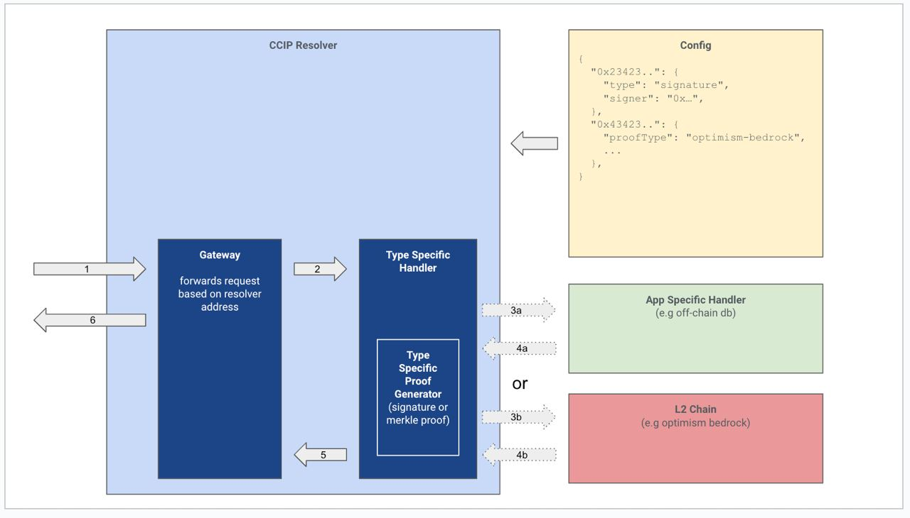

# A Generic ERC3668 Resolver

Storing data on Ethereum Mainnet is expensive hence it is appealing to use other storage solutions that offer more compelling rates. To facilitate this https://eips.ethereum.org/EIPS/eip-3668 introduces CCIP a standard that can be used to securely retrieve external data.

This repository contains contracts implementing the ERC-3668 standard to resolve data from an arbitrary data source. This might be based on another EVM Chain like Optimism, a Database like Postgress or any other way you might want to store data for your app.
Visit the App-specific Handler section to learn how to write a handler for your app.

# Architecture

## Smart Contracts

### ERC3668Resolver

The core contract implementing the Ccip Interface. It delegates the actual implementation to an instance of the CcipVerifier contract. Every Ens name owner can specify its verifier. This allows the Ens-name owner to declare different Data sources associated with their domain.

### CcipResponseVerifier

An App Specific Handler needs a CcipResponseVerifier contract that implements the `resolveWithProof` function accordingly. For example, the handler related to the optimism-Bedrock validates the Merkle proof for the returned data and ensures it is part of the Optimism Network.

### BedrockCcipVerifier

An implementation of the CcipResponseVerifier Interface. This contract is supposed to prove data from a certain contract on Optimism Bedrock.

## Gateway

The Gateway is a Node.js app resolving incoming requests made by the CCIP Reader. It queries the Type Specific handler defined in the Config to retrieve the desired data. You can host your gateway by simply using our docker file and providing your config file.

### Type Specific Handler

When CCIP is used the recipient that made a request has to trust the gateway that the returned data is correct. This is because the recipient doesn't have access to the underlying data source to look this up by themself. To handle this the CCIP flow contains the `resolveWithProof` function that can be used to verify the integrity of the data returned.
A Type Specific handler fetches the data from the data source and prepares the proof so it can be verified using `resolveWithProof`. At the moment we're supporting two different Handlers _Signature_ and _Optimism-Bedrock_

**Signature**

When the Signature Handler is used the Gateway computes a signature of the response data using a predefined private Key. When retrieving the data the recipient can use ECRecover to ensure the given signature was computed by the address defined in the CcipVerifer contract.
When this handler is used the Gateway is trusted. If the Gateway is corrupted the returned data might be corrupted as well.

**Optimism-Bedrock**

The Optimim Bedrock handler leverages the Optimism Bedrock protocol and enables a trustless way to store data on L2. The Optimism Node posts a hash to Ethereum Mainnet that contains the Stateroot of the entire Optimism Network. That Stateroot can be used to prove that certain data existed in account storage using Merkle proofs.

### App Specific Handler

App Specific handlers implement the actual data source and provide a REST interface so the Gateway can query it. An example using an L2 ENS Public Resolver contract as a data source can be found here: https://github.com/corpus-io/ENS-Bedrock-Resolver

## Resources

-   **Ethereum Improvement Proposals ERC-3668:** CCIP Read: Secure offchain data retrieval CCIP Read provides a mechanism to allow a contract to fetch external data.
-   **ENSIP-10: Wildcard Resolution:**
    Provides a mechanism to support wildcard resolution of ENS names (formerly EIP-2544). (36 kB)
    https://docs.ens.domains/ens-improvement-proposals/ensip-10-wildcard-resolution
-   **ENSIP-11: Wildcard Resolution:**
    Introduces coinType for EVM compatible chains (amending ENSIP9).
    https://docs.ens.domains/ens-improvement-proposals/ensip-11-evmchain-address-resolution

## Installation

1. Clone the repository `git clone https://github.com/corpus-io/Optimism-Resolver`
2. Install dependencies using `yarn install`

## Tests

This repository contains 3 different test suites. There are tests for the Smart contracts the Gateway server and the bedrock-related parts.
All tests associated with Bedrock require access to the Bedrock local development environment and the execution of setupEnvironment as described in the Bedrock test section. This might not be always feasible for example when a test should be executed in a CI Pipeline.
Thus the test suites can be executed separately

### Gateway tests

Run `yarn run test:gateway`

### Contract test

Run `yarn run test:contracts`

### Bedrock tests

The tests are based on the Optimism local development environment. To run them you've to run this environment on your machine.
Visit https://community.optimism.io/docs/developers/build/dev-node/ for setup instructions.

1. After you have set up the optimism development environment run `make devnet-up` to start it.
2. Wait at least 5 minutes until everything is set up. This is mandatory because the local development environment contains different containers that are started independently from each other.
3. Run `yarn run e2e:setup` to set up the environment required by the tests. This deploys the contracts and creates the initial data we're later going to prove.
4. Wait again for a few minutes. The rollup needs to commit the changes made. If you see the error "Account is not part of the provided state root" or "Provided proof is invalid" The commit is still pending
5. Run the test using `yarn test`

## Implementation
The CCIP-Resolver has already been used by the following projects

### ENS 

ENS uses the CCIP-Resolver to store records on Optimism

https://github.com/corpus-io/ENS-Bedrock-Resolver

## Deployments

### Bedrock ProofVerifier

Deploy the BedrockProofVerifier Contract using `yarn run deploy:bedrock-proof-verifier-goerli`

### ERC3668 Resolver

Deploy the BedrockProofVerifier Contract using `yarn run deploy:ccip-resolver-goerli`

### Bedrock CCIP Verifier

The BedrockCCIPVerifier just supports one contract on Optimism. If you want to use a different contract you have to deploy a new instance of that contract.

### Goerli

ERC3668 Resolver: 0xaeB973dA621Ed58F0D8bfD6299031E8a2Ac39FD4

#### Optimism Verifier

BedrockProofVerifier : 0x2231dA800580E27cAA4C45C43b2B6c1D1487eC6F
